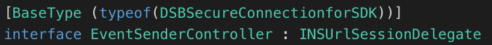
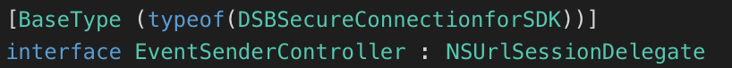

# DSB Mobile: Code Examples for Xamarin

[Description](#desc)

[Technical Information](#tech-desc)

[Demo](#demo)

[Previous Configurations](#considerations)

[License](#license)

<a name="desc"></a>

# Description

This code repository helps you to understand the correct implementation of the native libraries of DSB Mobile using Xamarin. The demo of this repository has the most important functionalities of DSB Mobile integrated. You can implement those functionalities to match your company's business logic.

>For more information of the DSB Mobile implementation, refer to the *Developer Guide*.

<a name="tech-desc"></a>
# Technical Information

This repository uses DSB Mobile 5.0. If you are using a previous version of the SDK, it is recommended to check the *Upgrade Guide* to get up to date with the benefits of the latest version of DSB Mobile.

### iOS

- Base SDK compiled: iOS 12.2.
- OS versions compatibility: From 8 to 12.
- Programing Language: Objective - C.

### Android

- API level SDK compiled: 28.
- API level version compatibility: From 16 to 28.
- Programing Language: Java.
- Dependency: Gson Library.

<a name="demo"></a>
# Demo
The project included in this repository runs a demo app that has two activities:

### Login activity
In this activity DSB Mobile is initialized. Once initialized, it validates the status of the device and the legitimacy of the connection to your company's servers. If both validations are completed successfully and no risks are found, DSB Mobile allows the login and sends the login data captured.

### Main activity
Once the login is completed, you are free to use the most important methods offered by DSB Mobile.

>This repository does not include the DSB Mobile library. To successfully execute the demo, it must have the DSB Mobile library. Contact [Cyxtera][cyxtera] to get the libraries for Android and iOS.

<a name="considerations"></a>
# Previous Configurations

To  integrate the DSB SDK using Xamarin, it is necessary to complete the following configurations:

>This section is meant to help you understand how to integrate the DSB Mobile library in your project. The repository's project already has this configurations.

## Creating the wrapper

Create the .dll wrapper:

1. Open Visual Studio and click on **New**.
2. Click on **Multiplatform > Library**, select **Multiplatform Library**.

Once you have created the library project, it is necessary to perform the following configurations on each OS:

## iOS

For iOS, it is necessary to create the **ApiDefinitions.cs** and **StructsAndEnums.cs** files using Sharpie 3.3.0. Create the files executing the following line in the Terminal:

``` sharpie bind --output=[OutputFolder] --namespace=[nameSpace] --sdk=[SupportSdk] [DSBFrameworkHeaders]/*.h ```

Where:

 - *OutputFolder* is where the files are going to be created.
 - *nameSpace* is the same nameSpace of the Xamarin project.
 - *SupportSDK* is the SDK supported by your computer.
 >To check the SDK supported by your computer, execute the following command in the Terminal ```xcodebuild -showsdks ```

 - *DSBFrameworkHeaders* is the path where the headers of DSB Mobile framework are located.

Once you have generated the files, you need to perform the following configurations in the project files **Structs.cs** and **ApiDefinition.cs**:

**Structs**
1. Copy the content of **StructsAndEnums.cs** to **Structs.cs**.
2. Change the variable types from *nuint* to *ulong* and *nint* to *int* or *ulong.*

**ApiDefinition**

1. Copy the content of the Sharpie generated file **ApiDefinitions.cs** to the project file **ApiDefinitions.cs**.
2. Remove the  **dsb_protector_sdk_ios** dependency.
3. Delete all the lines of code where you see a **Verify**.  

4. Replace all the **INSUrlSessionDelegate** interfaces

 for the class **NSUrlSessionDelegate**.
 
6. There are several **Constants** interfaces in this file, unify them under one interface by copying their content to the selected interface.

  

## Android

Add the DSB Mobile library and its dependencies to the project:

1. Go to the Android project.
2. Right-click on the **Jars** folder and select **Add Files**.
3. Add the DSB Mobile .aar and the gson dependencies.
> The dependencies must be in .jar format, xamarin allows only one .aar in the multiplatform project.

After adding the files, change their build action by going to their properties menu and clicking on **Build action > EmbeddedJar**.

## Generate the .dll

Build the project to generate the .dll wrapper. You can find the wrapper for iOS and Android in:
- [ProjectPath]/iOS/bin/Debug/[namespace].dll
- [ProjectPath]/Android/bin/Debug/[namespace].dll

## Adding the wrappers

Create a new hybrid project, go to **File > New solution > Multiplatform > App** and select **Native App**.

### iOS
To link the wrapper to the iOS project, follow the steps below:
1. Right-click on the **References** folder of the iOS project and click on **Edit References**.
2. Go to the **.NetAssembly** tab.
3. Click on *Browse* and select the corresponding .dll file, found in the path mentioned above.
4. Then, right-click on the iOS project and click on **Options**.
5. In the left-side panel of the *Options* menu, go to **Build > iOS Build** and do the following:
* Click on the checkbox **enable devices-specifics builds**
* Add the following line in the **additional mtouch arguments** field :
```--framework:[DSBFrameworkPath].framework```

> The previous configuration has to be completed for each build configuration, either *release* or *debug*

6. Import the library in the .cs file where DSB Mobile is going to be implemented:
 ``` using [nameSpace] ```

### Android
To link the wrapper to the Android project, follow these steps:
1. Right-click on the **References** folder and click on **Edit References**.
2. Go to the **.NetAssembly** tab and select the corresponding .dll file, found in the path mentioned above.
3. Import the library in the activity where DSB Mobile is going to be implemented:
``` using Net.Easysol.Dsb```

## License
----


[//]: #
   [cyxtera]: <https://www.cyxtera.com>
